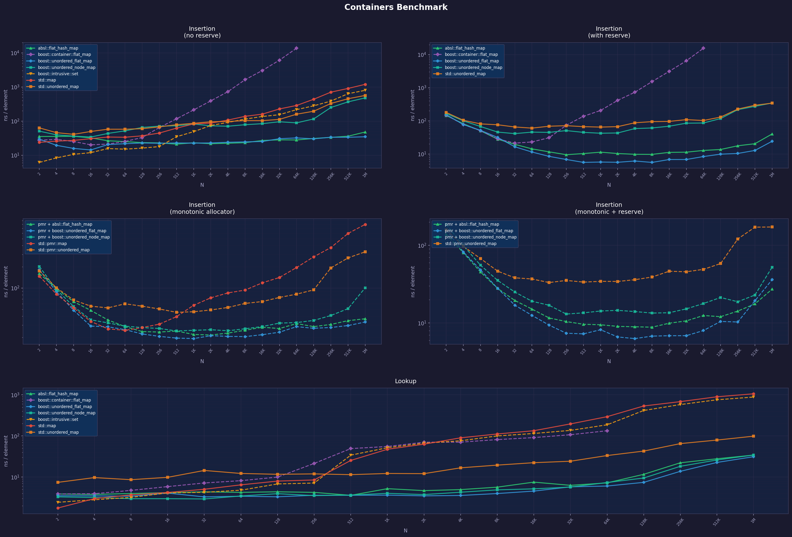

# Container Benchmark Results

## Environment

| | |
|---|---|
| **Date** | 2026-02-27 |
| **Host** | psemkin-HP-ProBook-450-G7 |
| **CPU** | 8 × 4200 MHz |
| **Compiler** | GCC 13 (C++23, `-O3`) |
| **Boost** | 1.83 |
| **Abseil** | 20220623 |
| **Google Benchmark** | v1.8.0 |

## Containers tested

| Alias | Full type |
|---|---|
| `std::map` | `std::map<uint32_t, Data>` — red-black tree |
| `std::unordered_map` | `std::unordered_map<uint32_t, Data>` — chaining hash table |
| `absl::flat_hash_map` | `absl::flat_hash_map<uint32_t, Data>` — open-addressing, SSE2 metadata |
| `boost::flat_map` | `boost::container::flat_map<uint32_t, Data>` — sorted contiguous array |
| `boost::unordered_flat_map` | `boost::unordered::unordered_flat_map<uint32_t, Data>` — open-addressing, SIMD group probing |
| `boost::unordered_node_map` | `boost::unordered::unordered_node_map<uint32_t, Data>` — node-based open-addressing |

`Data` = `{ float a; int b; }` (8 bytes).
All hash maps pre-allocated with `reserve(n)` before insertion.

---

## Insertion — ns per element

> Lower is better. `boost::flat_map` capped at N=65 536 (O(N²) array shifts).

| N | std::map | std::unordered_map | **absl::flat_hash_map** | boost::flat_map | **boost::unordered_flat_map** | boost::unordered_node_map |
|---:|---:|---:|---:|---:|---:|---:|
| 16 | 33.6 | 72.7 | 33.7 | 22.0 | **11.4** | 40.7 |
| 256 | 41.2 | 77.4 | 38.2 | 78.1 | **20.3** | 80.2 |
| 4 096 | 119.0 | 126.1 | **31.0** | 747.1 | **20.2** | 96.5 |
| 65 536 | 445.4 | 254.7 | **40.3** | 11 949 ⚠️ | **23.6** | 153.6 |
| 1 048 576 | 1 296.8 | 613.8 | **44.9** | ❌ O(N²) | **41.7** | 545.8 |

### Insertion winners
1. 🥇 **`boost::unordered_flat_map`** — fastest across the board
2. 🥈 **`absl::flat_hash_map`** — very close at large N, scales better above 64K
3. 🥉 `std::map` — decent at tiny N (cache-local tree), degrades sharply

---

## Lookup — ns per element

> Lower is better. Container pre-filled before timing; only `find()` is measured.

| N | std::map | std::unordered_map | **absl::flat_hash_map** | boost::flat_map | **boost::unordered_flat_map** | **boost::unordered_node_map** |
|---:|---:|---:|---:|---:|---:|---:|
| 16 | 6.9 | 14.9 | 6.1 | 9.3 | 6.9 | **5.0** |
| 256 | 12.4 | 16.1 | 6.7 | 25.2 | 6.7 | **5.4** |
| 4 096 | 124.8 | 23.5 | **6.7** | 92.8 | **6.6** | 7.1 |
| 65 536 | 460.0 | 53.8 | 13.4 | 129.7 | **10.0** | 13.0 |
| 1 048 576 | 1 170.4 | 93.7 | 41.9 | ❌ | **36.0** | 39.5 |

### Lookup winners
1. 🥇 **`boost::unordered_flat_map`** — best from N=4K to 1M
2. 🥈 **`boost::unordered_node_map`** — fastest at small N (≤1K), competitive overall
3. 🥉 **`absl::flat_hash_map`** — excellent, especially at mid-range N

---

## Key observations

### `boost::unordered_flat_map` 🏆
- Best **insertion** at every N tested
- Best **lookup** for N ≥ 4K
- Uses open-addressing with SIMD (SSE2/NEON) 15-element group probing — extremely cache-friendly

### `absl::flat_hash_map`
- Strong **lookup** across all N; pulls ahead of `boost::unordered_flat_map` only at _very_ large N in insertion
- Excellent predictable scaling — good general-purpose default

### `boost::unordered_node_map`
- **Insertion** is slow (individual node allocations)
- Surprisingly **fast lookup** at small N — SIMD metadata + stable pointers avoid rehash invalidation

### `std::map` (red-black tree)
- Competitive only at N < 32 (data fits in L1 cache, branch prediction helps)
- **O(log N)** lookup with pointer chasing → degrades badly beyond L2 cache

### `std::unordered_map`
- Worst **insertion** (chaining forces individual heap allocations)
- Lookup degrades slowly but never reaches hash-map efficiency — high constant factor from indirection

### `boost::container::flat_map`
- Fastest **lookup at tiny N** (simple binary search on sorted array → L1 cache ideal)
- **Insertion is O(N²)** — completely unusable above ~1K unless elements are inserted pre-sorted

---

## Recommendations

| Use case | Recommended |
|---|---|
| General key-value store (any N) | `boost::unordered_flat_map` or `absl::flat_hash_map` |
| Maximum lookup speed (N < 1K) | `boost::container::flat_map` (fill once, then query) |
| Need stable references after insert | `boost::unordered_node_map` |
| No external deps, decent performance | `std::unordered_map` |
| Ordered iteration required | `std::map` or `boost::container::flat_map` |

---

## Chart

*Both axes are log-scale. X = number of elements, Y = time per element in nanoseconds.*
